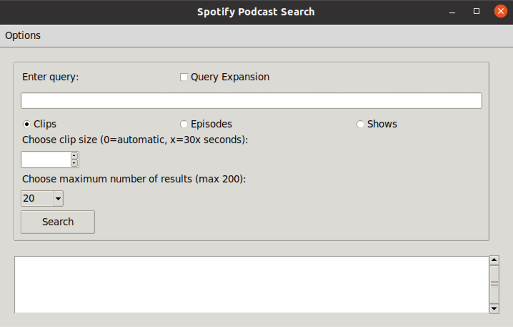

# Spotify-Podcast-Search
Project for DD2477. A search engine of a Spotify podcasts dataset, using Elasticsearch and an interactive interface.


## Installation
The best way to get an Elasticsearch framework is through Docker.
Obtaining Elasticsearch for Docker is as simple as issuing a docker pull command against the Elastic Docker registry.
```commandline
docker pull docker.elastic.co/elasticsearch/elasticsearch:8.7.1
```

The following commands start a single-node Elasticsearch cluster for development or testing.
```commandline
Create a new docker network for Elasticsearch and Kibana
```

Start Elasticsearch in Docker. A password is generated for the elastic user and output to the terminal, plus an enrollment token for enrolling Kibana
```commandline
docker run --name es01 --net elastic -p 9200:9200 -it docker.elastic.co/elasticsearch/elasticsearch:8.7.1
```

Copy your `ELASTIC_PASSWORD` and the `http_ca.crt` security certificate from your Docker container to your local machine.


## Index
1. Have ElasticSearch running;
2. Put `http_ca.crt` under the folder;
3. create a `pwd.txt` under the folder and paste your elasticsearch password to it.
4. Change the metadata and data directory to your own;
5. run [index.py](./index.py)

## Query Expansion
1. Run [get_text.py](./get_text.py), which would generate a txt file `padcast_text.txt` containing all the texts from the transcripts.
2. Run [random_indexing.py](./random_indexing.py), which would create a `vocab.txt` file and `ri.txt` file containing the dictionary of embeddings of all words;

## Search
1. Launch the GUI by executing [gui.py](./gui.py).
2. Put your query in the search bar, with the desired features.
3. Some search settings can be changed in [utils.py](./utils.py)

## Demo


